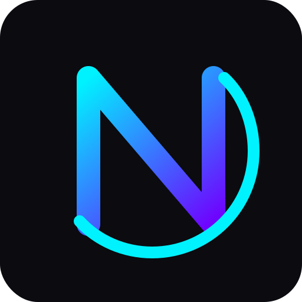

<p align="center">
  
</p>

<div align="center">

```
 █████╗ ██████╗ ███████╗██╗  ██╗███████╗ ██████╗ ██████╗  ██████╗ ███████╗
██╔══██╗██╔══██╗██╔════╝╚██╗██╔╝██╔════╝██╔═══██╗██╔══██╗██╔════╝ ██╔════╝
███████║██████╔╝█████╗   ╚███╔╝ █████╗  ██║   ██║██████╔╝██║  ███╗█████╗
██╔══██║██╔═══╝ ██╔══╝   ██╔██╗ ██╔══╝  ██║   ██║██╔══██╗██║   ██║██╔══╝
██║  ██║██║     ███████╗██╔╝ ██╗██║     ╚██████╔╝██║  ██║╚██████╔╝███████╗
╚═╝  ╚═╝╚═╝     ╚══════╝╚═╝  ╚═╝╚═╝      ╚═════╝ ╚═╝  ╚═╝ ╚═════╝ ╚══════╝

███╗   ██╗██╗ ██████╗ ██╗  ██╗████████╗███████╗ ██████╗██████╗ ██╗██████╗ ████████╗
████╗  ██║██║██╔════╝ ██║  ██║╚══██╔══╝██╔════╝██╔════╝██╔══██╗██║██╔══██╗╚══██╔══╝
██╔██╗ ██║██║██║  ███╗███████║   ██║   ███████╗██║     ██████╔╝██║██████╔╝   ██║   
██║╚██╗██║██║██║   ██║██╔══██║   ██║   ╚════██║██║     ██╔══██╗██║██╔═══╝    ██║   
██║ ╚████║██║╚██████╔╝██║  ██║   ██║   ███████║╚██████╗██║  ██║██║██║        ██║   
╚═╝  ╚═══╝╚═╝ ╚═════╝ ╚═╝  ╚═╝   ╚═╝   ╚══════╝ ╚═════╝╚═╝  ╚═╝╚═╝╚═╝        ╚═╝   
```

</div>

<p align="center">
  <b>Low-level control · Native UI · Kernel-ready · No Runtime Required</b>
</p>

<p align="center">
  
  
  
  
  
</p>

# ApexForge NightScript (AFNS)

> Low-level like C. Modern like Rust. Explicit like Zig. Simple like Odin. UI-native like Flutter. OS-integrated like TempleOS.
**ApexForge NightScript (AFNS)** is a next-generation low-level systems programming language designed for:

- Operating system development
- Kernel and driver programming
- Native GUI applications
- Cybersecurity tooling
- Cross-platform native applications
- Custom operating environments
- Native UI systems
- Embedded/system utilities
- Future sovereign computing ecosystems

NightScript is not designed to be "just another language".

It is designed to become a complete ecosystem for:

```text
Kernel Development
+ Native Applications
+ Integrated UI
+ System Tooling
+ Cross-Platform Native Targets
+ Operating Environment Creation
```

---

# Philosophy

NightScript was created around one core problem:

> Modern low-level development is fragmented.

Today:

- C gives low-level control but lacks safety and modern ergonomics.
- C++ is powerful but extremely complex.
- Rust is safe and modern but ecosystem-heavy and not UI-integrated.
- Flutter has beautiful UI but is not low-level.
- JavaScript depends heavily on browser/runtime environments.
- TempleOS showed powerful OS-language integration but lacked modern architecture.

NightScript attempts to combine the strongest ideas of these worlds into one coherent language ecosystem.

---

# Core Vision

NightScript aims to allow developers to:

```text
Write a kernel.
Build a GUI.
Create native apps.
Develop system tools.
Target multiple platforms.
Use one language.
```

---

# Core Identity

NightScript is:

```text
✔ Low-level
✔ Native
✔ OS-ready
✔ UI-native
✔ Explicit
✔ Cross-platform
✔ Systems-oriented
✔ Cybersecurity-friendly
✔ Kernel-capable
```

NightScript is NOT:

```text
✘ A web-first language
✘ A managed-runtime-only language
✘ A garbage-collector-first language
✘ A JavaScript clone
✘ A Rust clone
✘ A C++ replacement attempt
✘ A browser-dependent ecosystem
```

---

# Main Goals

## 1. OS Development

NightScript is designed from the beginning with:

- freestanding compilation
- kernel mode
- framebuffer graphics
- hardware access
- inline assembly
- memory control
- interrupt support
- bootloader compatibility

in mind.

---

## 2. Native UI

NightScript includes built-in declarative UI syntax.

Example:

```afns
ui app ControlPanel {
    fn main() -> i32 {
        window "NightOS" {
            size: { width: 900, height: 600 };

            button "Start" {
                onClick {
                    print("started");
                }
            }
        }

        return 0;
    }
}
```

Unlike JavaScript frameworks, NightScript UI is intended to compile into:

- SDL2
- framebuffer renderers
- Win32
- Wayland/X11
- Android NativeActivity
- future custom OS renderers

without requiring a browser runtime.

---

## 3. Cross-Platform Native Development

NightScript aims to support:

```text
Linux
Windows
Android
Custom OS targets
Future embedded targets
```

through native compilation.

---

## 4. Cybersecurity & System Tooling

NightScript is intended to be highly suitable for:

- network utilities
- forensic tools
- reverse engineering helpers
- native security dashboards
- packet analyzers
- system monitors
- OS-level utilities
- low-level cyber tooling

---

# Why NightScript Exists

Modern development ecosystems are fragmented.

Today developers often need:

```text
Rust/C for backend
Flutter/Qt for UI
Python for tooling
Shell scripting for automation
Different systems for kernels
Different systems for apps
```

NightScript attempts to reduce this fragmentation.

The long-term goal:

```text
One language.
One ecosystem.
One build system.
One UI model.
One systems-oriented workflow.
```

---

# Main Features

# Kernel Mode

NightScript includes dedicated kernel mode support.

Example:

```afns
kernel app NightOS {
    fn main() -> void {
        vga.print("NightOS booted");
    }
}
```

Kernel mode supports:

- freestanding builds
- no runtime dependency
- framebuffer graphics
- VGA/serial output
- low-level memory access
- interrupts
- inline assembly
- explicit unsafe operations

---

# Native UI Syntax

NightScript includes integrated UI syntax inspired by Flutter-style declarative systems.

Example:

```afns
window "Dashboard" {
    column {
        label "System Monitor";

        row {
            button "CPU" {
                onClick {
                    show_cpu();
                }
            }

            button "RAM" {
                onClick {
                    show_ram();
                }
            }
        }
    }
}
```

---

# Explicit Memory Management

NightScript does NOT use a default garbage collector.

Memory is explicit.

Example:

```afns
fn main(alloc: Allocator) -> void {
    let buf = alloc.alloc[u8](1024);
    defer alloc.free(buf);
}
```

Memory philosophy:

```text
Explicit > Hidden
Predictable > Automatic magic
System-friendly > Runtime-heavy
```

---

# Safe-ish by Default

NightScript aims to be safer than C while remaining low-level.

Unsafe operations require explicit unsafe blocks.

Example:

```afns
unsafe {
    let fb: *u32 = 0xB8000 as *u32;
    *fb = 0x00FF00;
}
```

---

# No Classical OOP

NightScript intentionally avoids:

```text
class inheritance
multiple inheritance
virtual inheritance
heavy runtime OOP systems
```

Instead it uses:

```text
struct
impl
interface
```

Example:

```afns
struct Window {
    title: str;
}

impl Window {
    fn show(self: *Window) -> void {
        ui.show_window(self);
    }
}
```

---

# Interfaces

NightScript uses interfaces instead of traits/classes.

Example:

```afns
interface Drawable {
    fn draw(self: *Self) -> void;
}
```

Implementation:

```afns
impl Button : Drawable {
    fn draw(self: *Button) -> void {
        ui.text(self.text);
    }
}
```

---

# Type System

NightScript provides explicit low-level types.

## Integer Types

```text
i8 i16 i32 i64
u8 u16 u32 u64
isize usize
```

## Floating Point

```text
f32
f64
```

## Other Primitive Types

```text
bool
char
void
never
```

---

# Strings

NightScript defines three string-related types:

```text
str
String
cstr
```

## str

Immutable string view.

```afns
let name: str = "NightScript";
```

## String

Heap-allocated dynamic string.

```afns
let s: String = String.from("Hello");
```

## cstr

C-compatible null-terminated string.

```afns
extern "C" fn puts(s: cstr) -> i32;
```

---

# Structs

Structs are the primary user-defined data type.

Example:

```afns
struct Vec2 {
    x: f32;
    y: f32;
}
```

---

# Enums

NightScript supports data-carrying enums.

```afns
enum Event {
    Click(x: i32, y: i32);
    Key(code: u32);
    None;
}
```

---

# Result & Option

NightScript avoids exceptions.

Instead:

```text
Result[T, E]
Option[T]
```

Example:

```afns
fn open_file(path: str) -> Result[File, Error] {
    // ...
}
```

---

# Pointer System

Pointers are first-class.

```text
*T
*const T
?*T
addr
```

Example:

```afns
let ptr: *u8 = 0xB8000 as *u8;
```

---

# Arrays & Slices

## Arrays

```afns
let data: [512]u8;
```

## Slices

```afns
fn write(data: []u8) -> void {
}
```

---

# Inline Assembly

NightScript supports inline assembly for OS development.

```afns
unsafe asm {
    "cli";
    "hlt";
}
```

---

# C ABI Compatibility

NightScript is designed to interoperate with C.

Example:

```afns
extern "C" fn puts(s: cstr) -> i32;
```

This enables:

- SDL2 integration
- Win32 integration
- existing native libraries
- kernel/bootloader integration
- OS APIs

---

# Package System

NightScript uses a simple package system inspired by Go.

```afns
package ui;
```

Imports:

```afns
import std.io;
import ui.window;
import kernel.vga;
```

---

# File Extensions

## Source Files

```text
.afns
```

Examples:

```text
main.afns
window.afns
kernel.afns
```

## Interface Files

```text
.afni
```

## Config File

```text
night.toml
```

---

# Build Tool

Compiler and package manager:

```text
night
```

Commands:

```bash
night init
night build
night run
night test
night fmt
night check
night clean
```

Cross-target examples:

```bash
night build --target linux-x64
night build --target windows-x64
night build --target kernel-x86_64
```

---

# Compiler Architecture

Initial architecture:

```text
.afns
   ↓
Lexer
   ↓
Parser
   ↓
AST
   ↓
Semantic Analysis
   ↓
Type Checker
   ↓
C Code Generation
   ↓
clang/gcc
```

Later:

```text
NightScript → LLVM IR
```

---

# Standard Library Layout

```text
core
alloc
std
ui
kernel
```

## core

No allocator.
No OS dependency.

## alloc

Dynamic allocation.

## std

Filesystem.
Networking.
Processes.
Time.

## ui

UI framework.

## kernel

Low-level OS utilities.

---

# Example Native App

```afns
package main;

import std.io;

native app Hello {
    fn main() -> i32 {
        io.print("Hello from NightScript");
        return 0;
    }
}
```

---

# Example UI App

```afns
package main;

ui app Demo {
    fn main() -> i32 {
        window "NightScript" {
            button "Click" {
                onClick {
                    print("clicked");
                }
            }
        }

        return 0;
    }
}
```

---

# Example Kernel App

```afns
package kernel.main;

import kernel.vga;

kernel app NightOS {
    fn main() -> void {
        vga.clear(0x101018);
        vga.print("NightOS booted");

        loop {
        }
    }
}
```

---

# Long-Term Vision

The long-term goal of NightScript is:

```text
A fully integrated systems ecosystem.
```

Potential future ecosystem:

```text
NightScript compiler
NightScript package manager
NightScript formatter
NightScript language server
NightUI framework
NightOS kernel
NightOS desktop environment
NightOS package system
NightOS SDK
NightOS cybersecurity tooling
```

---

# Planned Future Features

```text
LLVM backend
ARM support
Android support
NightOS GUI
framebuffer renderer
package registry
LSP support
formatter
debugger
profiling tools
comptime system
advanced generics
async runtime
network stack
filesystem drivers
GPU acceleration later
```

---

# Development Roadmap

## v0.1

```text
lexer
parser
AST
C transpiler
primitive types
functions
variables
if/else
while
structs
pointers
```

## v0.2

```text
enum
union
Result
Option
modules
unsafe
extern C
```

## v0.3

```text
build system
package system
basic standard library
```

## v0.4

```text
SDL2 backend
basic UI
window
button
label
```

## v0.5

```text
kernel target
framebuffer
serial output
keyboard input
```

## v0.6

```text
minimal NightOS GUI
window manager
mouse support
terminal panel
```

---

# Competitive Positioning

| Compared To | NightScript Focus |
|---|---|
| C | safer + more expressive |
| C++ | simpler + cleaner |
| Rust | OS/UI integrated |
| Zig | UI-native |
| Odin | kernel/UI ecosystem |
| Flutter | low-level native systems |
| JavaScript | runtime-independent native execution |

---

# Final Mission

NightScript exists for developers who want to build systems, not only applications.

The mission is:

```text
Build kernels.
Build GUIs.
Build native apps.
Build operating environments.
Use one coherent language ecosystem.
```

---

# Final Identity

```text
ApexForge NightScript (AFNS)

A low-level, OS-ready, UI-native systems programming language
built for operating systems, native applications,
cybersecurity tooling, and future sovereign computing ecosystems.
```

---

# Status

```text
Language Design Phase
```

Future repositories may include:

```text
AFNS Compiler
NightUI
NightOS
AFNS Standard Library
Night Package Registry
```

---

# License

Planned: Open Source

Potential options:

```text
MIT
Apache-2.0
BSD-3-Clause
```

---

# ApexForge

Designed and envisioned by ApexForge.


